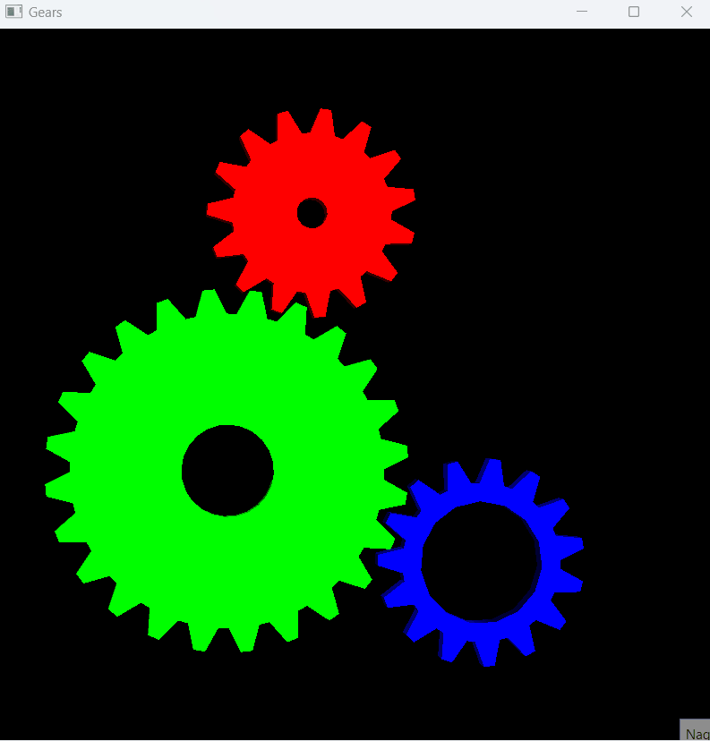

# Wizualizacja Ruchu Kół Zębatych

## 1. Wstęp
### 1.1 Cel projektu
Celem projektu było stworzenie aplikacji wizualizującej ruch kół zębatych przy użyciu biblioteki OpenGL oraz GLFW. Aplikacja umożliwia interaktywną zmianę widoku sceny za pomocą klawiatury oraz obserwację działania mechanizmu zębatego w czasie rzeczywistym.

### 1.2 Zakres projektu
Projekt obejmował implementację rysowania kół zębatych, obsługę kamery, shaderów oraz interakcje użytkownika z wykorzystaniem klawiatury i myszy.

## 2. Implementacja
### 2.1 Główne komponenty
Aplikacja składa się z trzech głównych komponentów:
1. **main.cpp** - główny plik programu, zawiera inicjalizację okna, rysowanie kół zębatych oraz obsługę wejścia użytkownika.
2. **Camera.cpp** - implementacja klasy kamery, która obsługuje ruch kamery oraz przekształcenia macierzy widoku i projekcji.
3. **ShaderClass.cpp** - klasa obsługująca shadery, odpowiedzialna za ładowanie, kompilowanie i aktywowanie shaderów.

### 2.2 Szczegółowa implementacja
#### 2.2.1 Plik main.cpp

```cpp
#include <iostream>
#include <GLFW/glfw3.h>
#include <math.h>
#include <windows.h>

// Deklaracja zmiennych globalnych
float angle1 = 3.1415926;
static GLint rack1, rack2, rack3;
static GLfloat view_rotx = 20.f, view_roty = 30.f, view_rotz = 0.f;
static GLint gear1, gear2, gear3;
static GLfloat angle = 0.f;

/* Funkcja rysująca koło zębate */
void rack(GLfloat x, GLfloat y, GLfloat insideRadius, GLfloat outsideRadius, GLint tooth, GLfloat toothLength, float r, float g, float b) {
    // Implementacja rysowania koła zębatego
    // Funkcja rack rysuje koło zębate. Przyjmuje następujące argumenty:

        GLfloat x, GLfloat y: współrzędne środka koła.
        GLfloat insideRadius, GLfloat outsideRadius: wewnętrzny i zewnętrzny promień koła.
        GLint tooth: liczba zębów koła.
        GLfloat toothLength: długość zęba.
        float r, float g, float b: kolor koła w formacie RGB.
}

void key(GLFWwindow* window, int k, int s, int action, int mods) {
    // Obsługa wejścia z klawiatury
    // Funkcja key obsługuje zdarzenia klawiatury:

        GLFW_KEY_Z: obrót widoku wokół osi Z.
        GLFW_KEY_ESCAPE: zamknięcie okna.
        GLFW_KEY_UP, GLFW_KEY_DOWN: obrót widoku wokół osi X.
        GLFW_KEY_LEFT, GLFW_KEY_RIGHT: obrót widoku wokół osi Y.
}

void reshape(GLFWwindow* window, int width, int height) {
    // Obsługa zmiany rozmiaru okna
    // Funkcja reshape ustawia proporcje okna oraz perspektywę widoku.
}

void init() {
    // Inicjalizacja sceny
    // Funkcja init inicjalizuje scenę, ustawiając światła i generując listy wyświetlania dla trzech kół zębatych.
}

int main() {
    // Główna funkcja programu
    // Inicjalizuje GLFW, tworzy okno, ustawia funkcje zwrotne oraz pętlę renderującą.
}
```
#### 2.2.2 Plik Camera.cpp:
```cpp
#include "Camera.h"

Camera::Camera(int width, int height, glm::vec3 position) {
    // Konstruktor klasy Camera
}

void Camera::Matrix(float FOVdeg, float nearPlane, float farPlane, ShaderClass& shader, const char* uniform) {
    // Przekształcenia macierzy widoku i projekcji
}

void Camera::Inputs(GLFWwindow* window) {
    // Obsługa wejścia z klawiatury i myszy
}
```
#### 2.2.3 Plik ShaderClass.cpp:
```cpp
#include "ShaderClass.h"

std::string get_file_contents(const char* filename) {
    // Funkcja do odczytu plików shaderów
}

ShaderClass::ShaderClass(const char* vertexFile, const char* fragmentFile) {
    // Konstruktor klasy ShaderClass
}

void ShaderClass::Activate() {
    // Aktywowanie shaderów
}

void ShaderClass::Delete() {
    // Usuwanie shaderów
}

void ShaderClass::compileErrors(unsigned int shader, const char* type, std::string shaderCode) {
    // Obsługa błędów kompilacji shaderów
}
```
## 3. Użycie
### 3.1 Sterowanie
- Klawisze strzałek: obrót widoku. 
-  Klawisz Z: obrót wokół osi Z.
- Klawisz Esc: zamknięcie aplikacji.
### 3.2 Wyniki działania


## 4. Wnioski
Projekt umożliwił zapoznanie się z biblioteką OpenGL oraz GLFW, a także z technikami rysowania i animacji obiektów 3D. Aplikacja demonstruje podstawowe zasady działania mechanizmu zębatego oraz pozwala na interaktywne eksplorowanie sceny 3D.
## 5. Źródła
- Dokumentacja OpenGL: https://www.opengl.org/documentation/
- Dokumentacja GLFW: https://www.glfw.org/docs/latest/